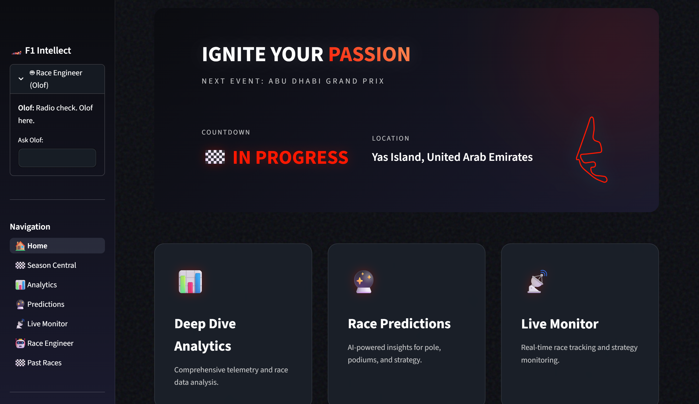
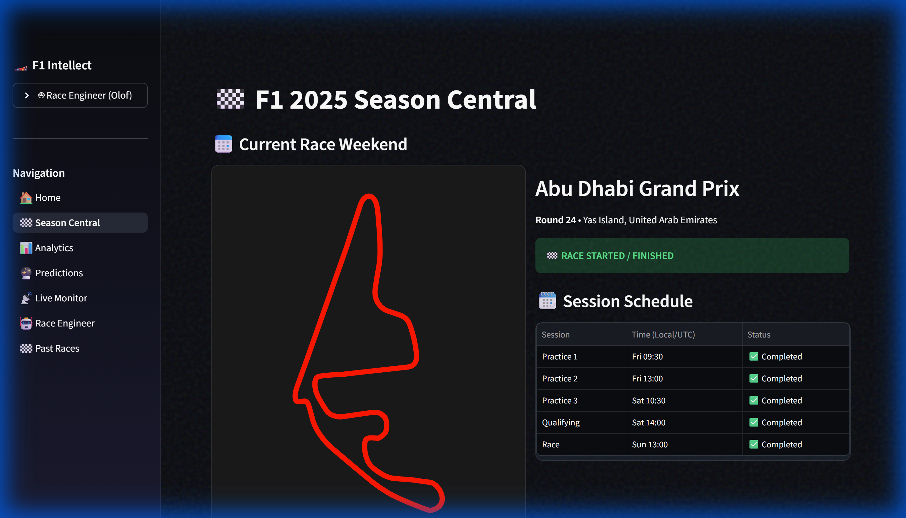
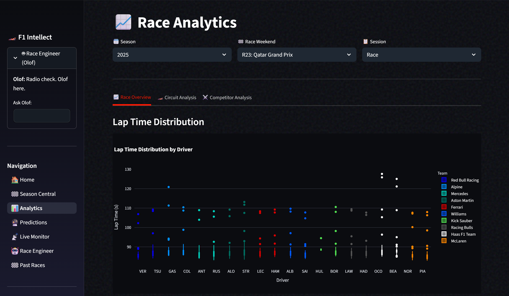
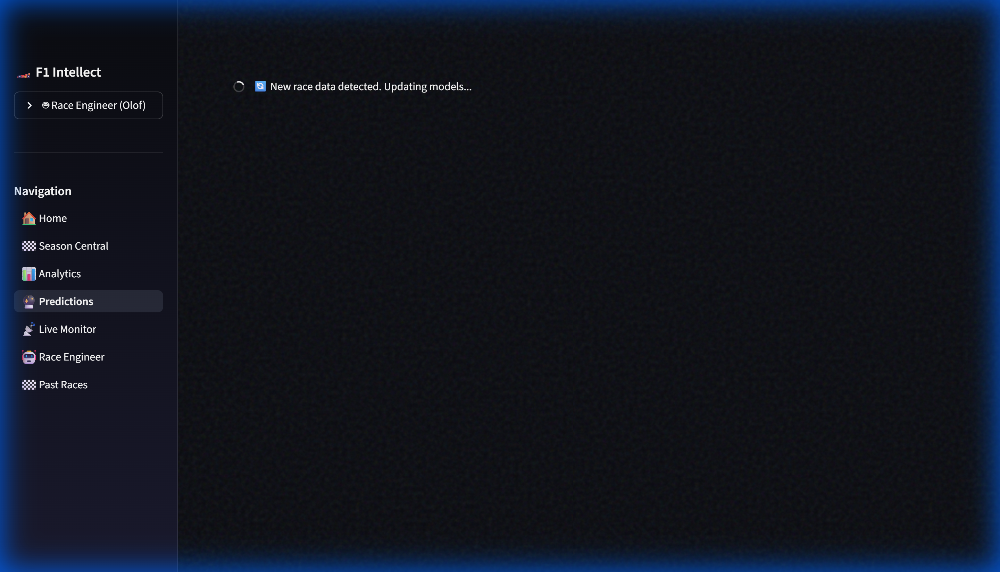

<div align="center">

# 🏎️ PitWall AI

### AI-Powered Formula 1 Race Strategy & Prediction Platform

[](https://python.org)
[](https://streamlit.io)
[](LICENSE)
[](https://github.com/theOehrly/Fast-F1)

*Advanced machine learning models combining LightGBM, XGBoost, and Monte Carlo simulations to predict F1 race outcomes with statistical confidence.*

---

</div>

## 📸 Screenshots

<div align="center">

### Dashboard Overview


### Season Central - Championship Standings & Trends


### Race Analytics - Deep Dive Into Race Data


### Race Predictions - Monte Carlo Simulations


### Past Races - Historical Race Replay


</div>

---

## ✨ Features

### 🎯 Race Predictions
- **Monte Carlo Simulation Engine** - Run thousands of simulations for probabilistic race outcome predictions
- **Hybrid ML Models** - Ensemble of LightGBM Ranker and XGBoost Regressor for maximum accuracy
- **Weather-Aware Predictions** - Adjust predictions based on wet/dry conditions
- **Confidence Intervals** - Statistical confidence levels for all predictions

### 📊 Season Analytics
- **Championship Progression** - Interactive charts showing driver and constructor standings over time
- **Teammate Comparisons** - Head-to-head performance analysis within teams
- **Points Trajectory** - Visualize championship battles and momentum shifts

### 🏁 Race Analytics
- **Lap Time Analysis** - Detailed lap-by-lap performance breakdowns
- **Tire Strategy Insights** - Compound degradation and pit stop optimization
- **Position Progression** - Interactive race position charts
- **Sector Performance** - Track segment analysis with driver comparisons

### 📡 Live Race Monitor
- **Real-Time Timing** - Live position and lap time updates during races
- **Dynamic Track Map** - Visual representation of driver positions on track
- **Gap Analysis** - Real-time gap calculations between drivers
- **Pit Stop Alerts** - Instant notifications for pit activity

### 🔬 Race Engineer AI
- **AI-Powered Insights** - Natural language race strategy recommendations
- **Historical Pattern Analysis** - Data-driven strategy suggestions based on past races
- **What-If Scenarios** - Explore alternative strategy outcomes

### 📜 Past Race Replay
- **Historical Race Data** - Access complete data from past F1 seasons (2018+)
- **Race Reconstruction** - Step-by-step replay of historical races
- **Performance Comparison** - Compare driver performances across different races

---

## 🧠 Model Architecture

PitWall AI employs a sophisticated multi-model ensemble approach:

### DynastyEngine (LightGBM Ranker)
The core prediction engine using a **LambdaRank** objective optimized for ranking race positions:

- **Elo Rating System** - Dynamic driver and team ratings updated after each race
- **Track DNA Classification** - Circuit-specific characteristics (High-Speed, Technical, Street, Balanced)
- **Feature Engineering Pipeline**:
  - Driver Elo ratings (individual performance tracking)
  - Team Elo ratings (constructor performance)
  - Track type encoding (one-hot encoded circuit characteristics)
  - Overtaking difficulty coefficient
  - Weather conditions encoding

### HybridPredictor (XGBoost Ensemble)
An enhanced prediction layer combining multiple models:

```
┌─────────────────────────────────────────────────────────────┐
│                    HybridPredictor Pipeline                  │
├─────────────────────────────────────────────────────────────┤
│  Input Features                                              │
│  ├── Driver/Team Elo Ratings                                │
│  ├── Track DNA (Type, Overtaking Score)                     │
│  ├── Recent Form (Last 3 races)                             │
│  ├── Grid Position                                          │
│  └── Weather Forecast                                        │
├─────────────────────────────────────────────────────────────┤
│  Models                                                      │
│  ├── LightGBM Ranker (position ranking)                     │
│  ├── XGBoost Regressor (expected position)                  │
│  └── Residual Sampling (uncertainty quantification)          │
├─────────────────────────────────────────────────────────────┤
│  Monte Carlo Simulation (N=5000)                             │
│  └── Produces probability distributions for each position   │
├─────────────────────────────────────────────────────────────┤
│  Output                                                      │
│  ├── Expected Finish Position                               │
│  ├── Win Probability %                                      │
│  ├── Podium Probability %                                   │
│  └── Points Expectation                                      │
└─────────────────────────────────────────────────────────────┘
```

### Track DNA System
Each circuit is classified with unique characteristics:

| Track Type | Characteristics | Example Circuits |
|------------|-----------------|------------------|
| **High_Speed** | Long straights, high top speeds | Monza, Spa, Las Vegas |
| **Technical** | Complex corners, requires precision | Monaco, Singapore, Hungary |
| **Street_Fast** | Street circuits with fast sections | Jeddah, Melbourne |
| **Balanced** | Mix of speed and technical sections | Bahrain, Abu Dhabi |

---

## 🚀 Getting Started

### Prerequisites
- Python 3.9+
- Supabase account (for database storage)
- Google AI API key (optional, for AI-powered insights)

### Installation

1. **Clone the repository**
```bash
git clone https://github.com/anshul-ghate/PitWall-AI.git
cd PitWall-AI
```

2. **Create virtual environment**
```bash
# Windows
python -m venv .venv
.\.venv\Scripts\Activate

# macOS/Linux
python3 -m venv .venv
source .venv/bin/activate
```

3. **Install dependencies**
```bash
pip install -r requirements.txt
```

4. **Configure environment**
```bash
cp .env.example .env
# Edit .env with your credentials
```

5. **Run the application**
```bash
streamlit run app/main.py
```

The app will be available at `http://localhost:8501`

---

## 📁 Project Structure

```
PitWall-AI/
├── app/                        # Streamlit web application
│   ├── main.py                # Main dashboard entry point
│   ├── components/            # Reusable UI components
│   │   ├── sidebar.py        # Navigation sidebar
│   │   ├── race_replay.py    # Race replay component
│   │   └── charts.py         # Chart utilities
│   └── pages/                 # Multi-page app
│       ├── 1_Season_Central.py
│       ├── 2_analytics.py
│       ├── 3_predictions.py
│       ├── 4_live_monitor.py
│       ├── 5_race_engineer.py
│       └── 6_past_races.py
├── models/                     # ML models
│   ├── dynasty_engine.py      # LightGBM Ranker + Elo system
│   ├── hybrid_predictor.py    # XGBoost ensemble predictor
│   ├── simulation.py          # Monte Carlo simulation engine
│   ├── feature_engineering.py # Feature extraction pipeline
│   └── saved/                 # Trained model artifacts
├── utils/                      # Utility modules
│   ├── db.py                  # Supabase database connection
│   ├── race_utils.py          # Race data utilities
│   └── ai.py                  # Google AI integration
├── scripts/                    # Automation scripts
│   ├── auto_update.py         # Scheduled data updates
│   └── check_deployment.py    # Deployment verification
├── docs/                       # Documentation
│   └── screenshots/           # Application screenshots
├── tests/                      # Test suite
├── requirements.txt           # Python dependencies
├── .env.example              # Environment template
└── README.md                  # This file
```

---

## 🔧 Configuration

### Environment Variables

| Variable | Description | Required |
|----------|-------------|----------|
| `SUPABASE_URL` | Supabase project URL | ✅ |
| `SUPABASE_KEY` | Supabase service role key | ✅ |
| `GOOGLE_API_KEY` | Google AI API key | Optional |

### Model Training

To retrain the prediction models with latest data:

```bash
python models/train_model.py
```

---

## 📊 Technologies

<div align="center">

| Category | Technologies |
|----------|-------------|
| **Frontend** | Streamlit, Plotly, Matplotlib |
| **ML Models** | LightGBM, XGBoost, Scikit-learn |
| **Data Processing** | Pandas, NumPy |
| **F1 Data** | FastF1 API |
| **Database** | Supabase (PostgreSQL) |
| **AI Features** | Google Generative AI |

</div>

---

## 🚀 Deployment

### Streamlit Community Cloud (Recommended)

1. Push your code to GitHub
2. Visit [share.streamlit.io](https://share.streamlit.io)
3. Connect your repository
4. Set main file: `app/main.py`
5. Add secrets in app settings:
   ```toml
   GOOGLE_API_KEY = "your_key"
   SUPABASE_URL = "your_url"
   SUPABASE_KEY = "your_key"
   ```
6. Deploy!

For detailed instructions, see [DEPLOYMENT.md](DEPLOYMENT.md)

---

## 🤝 Contributing

Contributions are welcome! Please feel free to submit a Pull Request.

1. Fork the repository
2. Create your feature branch (`git checkout -b feature/AmazingFeature`)
3. Commit your changes (`git commit -m 'Add AmazingFeature'`)
4. Push to the branch (`git push origin feature/AmazingFeature`)
5. Open a Pull Request

---

## 📝 License

This project is licensed under the MIT License - see the [LICENSE](LICENSE) file for details.

---

## ⚠️ Disclaimer

This application is for **educational and entertainment purposes only**. Predictions are based on historical data and statistical models and should not be used for betting or financial decisions.

---

## 🙏 Acknowledgments

- [FastF1](https://github.com/theOehrly/Fast-F1) - Exceptional F1 data API
- [Supabase](https://supabase.com/) - Database infrastructure
- The Formula 1 community for inspiration

---

<div align="center">

**Made with ❤️ for F1 fans**

🏁 *Enjoy predicting F1 races!* 🏁

</div>
