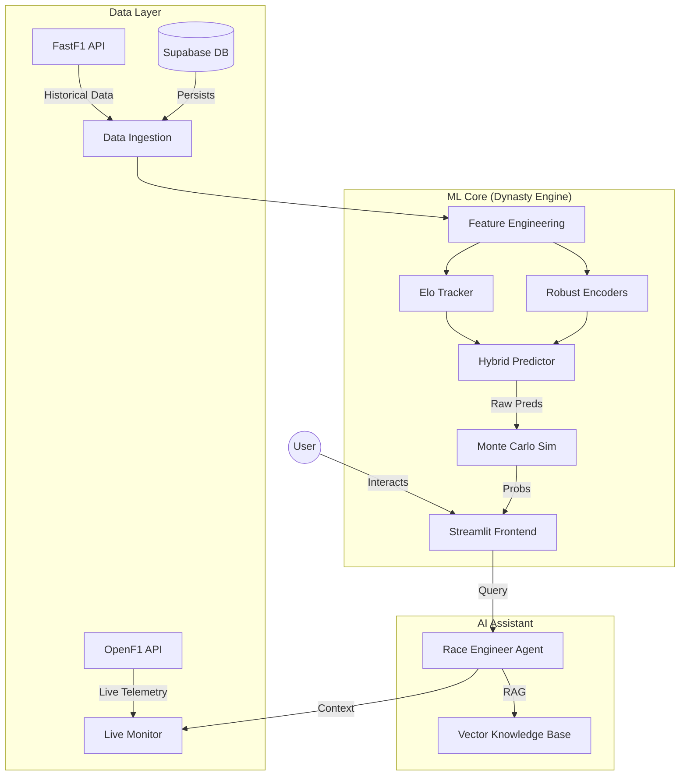

# 🏎️ F1 PitWall AI - Advanced Race Strategy & Analytics Platform


**F1 PitWall AI** is a state-of-the-art predictive analytics platform for Formula 1, powered by hybrid machine learning models and real-time telemetry processing. It provides race engineers, strategists, and fans with professional-grade insights, live race monitoring, and "what-if" scenario simulation.

---

## 🚀 Key Features

### 🧠 Hybrid Prediction Engine
- **Multi-Model Architecture**: Combines **LightGBM Ranker** (for relative performance) and **XGBoost Regressor** (for lap-time delta) with a **Monte Carlo** simulation layer.
- **Dynamic Elo Ratings**: Real-time driver and team skill quantification that evolves race-by-race.
- **Track DNA Analysis**: Classifies circuits by characteristics (e.g., "Street_Fast", "Power", "Technical") to predict suitability.

### 📡 Real-Time Telemetry Monitor
- **Live Race Visualization**: Watch driver positions, gaps, and telemetry (Speed, Gear, DRS) in real-time using OpenF1 API.
- **Strategy Analysis**: Live tyre degradation monitoring and pit window tracking.
- **Weather Integration**: Rain probability and track temperature monitoring.

### 🔬 Deep Dive Analytics
- **Interactive Telemetry Comparison**: Compare lap traces between any two drivers (Speed vs Distance).
- **3D Track Mapping**: Visualize speed and gear usage on a 3D circuit model.
- **Season Central**: Comprehensive dashboard for championship standings, calendar, and results.

### 🤖 AI Race Engineer ("Olof")
- **Natural Language Interface**: Ask questions like *"What is Verstappen's average lap time on Hards?"* or *"Who has the best sector 3?"*
- **RAG-Powered**: Retrieval-Augmented Generation system with access to live session data and historical records.

---

## 🏗️ Architecture



## 🛠️ Installation & Setup

### Prerequisites
- Python 3.10 or higher
- [Optional] Supabase account for cloud persistence (defaults to local cache if not provided)

### 1. Clone the Repository
```bash
git clone https://github.com/your-org/f1-pitwall-ai.git
cd f1-pitwall-ai
```

### 2. Install Dependencies
```bash
pip install -r requirements.txt
```

### 3. Environment Configuration
Create a `.env` file in the root directory:
```bash
# Optional: For AI Assistant features
GOOGLE_API_KEY=your_gemini_key

# Optional: For Database persistence
SUPABASE_URL=your_supabase_url
SUPABASE_KEY=your_supabase_key
```

### 4. Run the Application
```bash
streamlit run app/main.py
```

---

## 🧪 Testing & Validation

The project includes a comprehensive CI/CD pipeline (`.github/workflows/ci.yml`) that runs:
- **Linting**: Ruff & Black for code quality.
- **Unit Tests**: `pytest` suite for model validation.
- **Security Scans**: Bandit & Safety for vulnerability checks.

To run tests locally:
```bash
pytest tests/
```

---

## 🤝 Contributing

Contributions are welcome! Please follow these steps:
1. Fork the repository.
2. Create a feature branch (`git checkout -b feature/AmazingFeature`).
3. Commit your changes (`git commit -m 'Add some AmazingFeature'`).
4. Push to the branch (`git push origin feature/AmazingFeature`).
5. Open a Pull Request.

## 📄 License

Distributed under the MIT License. See `LICENSE` for more information.

---

*Note: This project is unofficial and not associated in any way with the Formula 1 companies. F1, FORMULA ONE, FORMULA 1, FIA FORMULA ONE WORLD CHAMPIONSHIP, GRAND PRIX and related marks are trade marks of Formula One Licensing B.V.*
